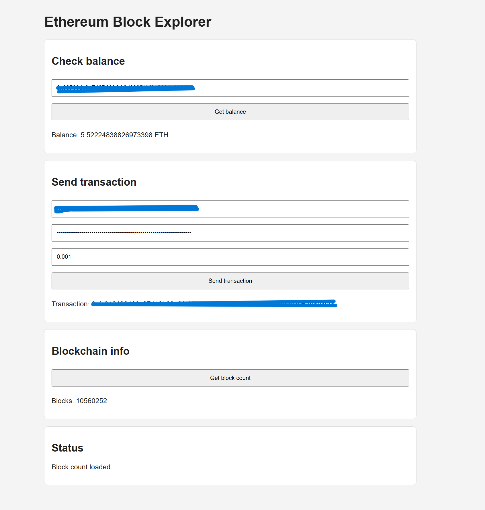

# Ethereum Block Explorer

<p align="left">
  
</p>

---


---

## Overview

This project is a frontend Ethereum block explorer built with JavaScript.
It connects to the Sepolia test network through Infura and allows the user to:

- check the balance of an Ethereum address in ETH
- send a transaction
- view the current block count

The project was built with a focus on clean structure, ES6 modules, separation of concerns, object-oriented design, and validation testing.

---

## Application Preview



---

## Features

- Get wallet balance in ETH
- Send Ethereum transactions on Sepolia
- Show current blockchain block count
- Validate wallet address, private key, and transaction amount
- Modular architecture using ES6 modules
- Simple OOP structure with a main application class
- Unit tests with Vitest

---

## Tech Stack

- JavaScript (ES6 Modules)
- HTML5
- CSS3
- Ethers.js
- Vitest
- Infura RPC
- Sepolia test network

---

## Requirements

Before running the project, make sure the following are installed:

- [Node.js](https://nodejs.org/)
- npm (included with Node.js)
- A local development server such as `serve`
- A Sepolia RPC endpoint, for example from Infura

---

## Installation

Clone the repository:

```bash or powershell in VS-code
git clone https://github.com/CarlJosef/block-explorer-js.git
cd block-explorer-js
```

---

## Install project dependencie

    - npm install

    - In js/config.js: add your Sepolia RPC URL:

_add only this_

- export const rpcUrl = "https://sepolia.infura.io/v3/YOUR_PROJECT_ID";

## Run the application

npx serve . = starts a local dev server and then open

`http://localhost:3000`

---

## Tests

npm test

---

### Project Structure

block-explorer-js/
├── assets/
│ └── block-explorer-screenshot.png
├── css/
│ └── styles.css
├── js/
│ ├── services/
│ │ └── blockchainService.js
│ ├── ui/
│ │ ├── dom.js
│ │ └── render.js
│ ├── utils/
│ │ └── validators.js
│ ├── BlockchainApp.js
│ ├── config.js
│ └── main.js
├── tests/
│ └── validators.test.js
├── index.html
├── LICENSE
├── package.json
└── README.md

---

### Verification

Verified by CarlJosef -:- 2026-03-31. Version 1.0.0
